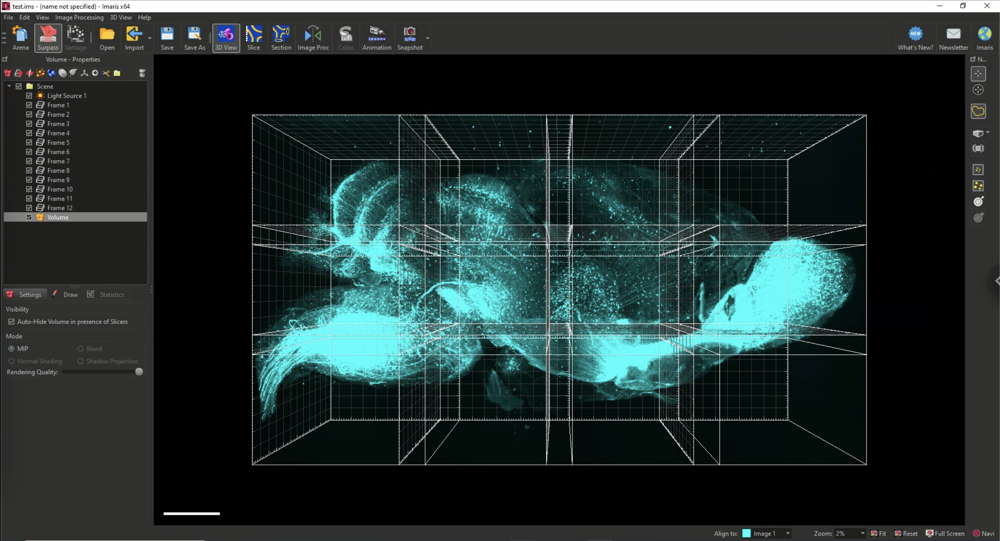

## imaris-linker
A simple python script for externally linking multiple imaris files. 


### Intro and Basic Usage
````cmd
python imaris_linker.py
--path C:\example_data
--filename example.ims
--x_tiles 2
--y_tiles 3
--z_tiles 1
--channels 488 561
--color_range 0 1000 0 500
--color 0 1 0 0 0 1
````
### Assumptions
This script assumes imaris files are individual tiles in a single directory, named as:
````
tile_x_####_y_####_z_####_ch_###.ims
````
This script also assumes that the ````color_range```` and ````color```` arguments are entered as follows:
````
--channels channel1 channel2
--color_range min1 max1 min2 max2
--color r1 g1 b1 r2 g2 b2
````
for ````channel1```` and ````channel2```` respectively.

### Implementation details
This script loops over the individual imaris files, copying the ````DataSetInfo```` group into the combined output imaris file. For each resolution level of the data within the ````DataSet```` group, an external link is made to the individual imaris file. The naming convention of groups within the combined output imaris file are:

````
DataSet
DataSet1
Dataset2
Dataset3
.
.
.
DataSetInfo
DataSetInfo1
DatasetInfo2
DatasetInfo3
.
.
.
````
To enable automated loading of multiple imaris files, the attributes below must be defined at the parent group level of the output imaris file (case-sensitive):
````
DataSetDirectoryName
DataSetInfoDirectoryName
ImarisDataSet
ImarisVersion
NumberOfDataSets
ThumnailDirectoryName
````
If the individual imaris files are generated at different times, then the date/time attributes must be omitted, otherwise imaris will assume that there is a time dependence to the data. This includes omitting copying all of the DataSetInfo group from each invidiaul imaris file, and deleting the  ````RecordingData```` attribute from ````DataSetInfo\Image````.

In certain places, this script uses the low-level h5py API. For example, to create properly formatted hdf5 string attributes.
These strings must be ASCII-formatted, length=1, with NULLTERM padding. Complete documentation can be found at the [low-level h5py API](https://api.h5py.org/index.html).
